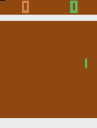
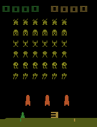
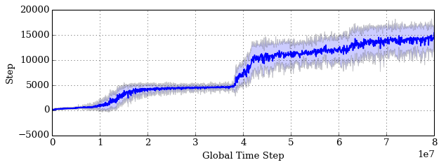

# Efficient Parallel Methods for Deep Reinforcement Learning
This repository contains an open source implementation of the PAAC algorithm presented in [Efficient Parallel Methods for Deep Reinforcement Learning](https://arxiv.org/abs/1705.04862).
PAAC is a conceptually simple advantage actor-critic algorithm designed to run efficiently on a GPU.






# Pretrained models
Pretrained models for some games can be found [here](pretrained).
These models can be used as starting points for training on the same game, other games, or to generate gifs.

# Runing via docker (recommended)
1. Follow the instructions to install [nvidia-docker](https://github.com/NVIDIA/nvidia-docker/)
2. Clone this repository
3. Run the container with ```nvidia-docker run -it -v <absolute-path>/paac:/root/paac -p 6006:6006 alfredvc/tf1-ale bash```.

A CPU version of the docker container is also provided and can be run with ```docker run -it -v <absolute-path>/paac:/root/paac -p 6006:6006 alfredvc/tf1-ale:cpu bash```.
When running on the CPU pass the device flag ```-d '/cpu:0'``` to the training script.

# Runing locally
Requirements
* Python 3.4+
* TensorFlow 1.0+
* [Arcade-Learning-Environment](https://github.com/mgbellemare/Arcade-Learning-Environment)
* cython (pip3 package)
* scikit-image (pip3 package)
* python3-tk

# Training the agent
To train an agent to play, for example, pong run
* ```python3 train.py -g pong -df logs/```

For pong, the agent will begin to learn after about 5 million frames, and will learn an optimal policy after about 15 million frames.

Training can be stopped, for example by using Ctrl+c, and then resumed again by running ```python3 train.py -g pong -df logs/```.

On a setup with an [Intel i7-4790k](http://ark.intel.com/products/80807/Intel-Core-i7-4790K-Processor-8M-Cache-up-to-4_40-GHz) CPU and an [Nvidia GTX 980 Ti](http://www.geforce.com/hardware/desktop-gpus/geforce-gtx-980-ti) GPU with default settings, you can expect around 3000 timesteps (global steps) per second.
Training for 80000000 timesteps requires under 8 hours.

Qbert



## Visualizing training
1. Open a new terminal
2. Attach to the running docker container with ```nvidia-docker exec -it CONTAINER_NAME bash```
3. Run ```tensorboard --logdir=<absolute-path>/paac/logs/tf```.
4. In your browser navigate to localhost:6006/

If running locally, skip step 2.

# Testing the agent
To test the performance of a trained agent run ```python3 test.py -f logs/```

# Adapting the code
This codebase was designed to be easily modified to new environments and new neural network architectures.

## Adapting to a new environment
The codebase currently contains a single environment, namely ```atari_emulator.py```. To train on a new environment, simply 
create a new class that inherits from ```BaseEnvironment``` and modify ```environment_creator.py``` to create an instance of your new environment.

## Adapting to new neural network architectures
The codebase contains currently two neural network architectures, the architecture used in [Playing Atari with Deep Reinforcement Learning](https://arxiv.org/abs/1312.5602), and the architecture from [Human-level control through deep reinforcement learning](https://www.nature.com/nature/journal/v518/n7540/full/nature14236.html). Both adapted to an actor-critic algorithm.
To create a new architecture follow the pattern demonstrated in ```NatureNetwork``` and ```NIPSNetwork```.
Then create a new class that inherits from both the ```PolicyVNetwork``` and```YourNetwork```. For example:  ```NewArchitecturePolicyVNetwork(PolicyVNetwork, YourNetwork)```. Then use this class in ```train.py```.

# Citing PAAC
If you use PAAC in your research, we ask that you please cite our paper:
(citation to come)

The paper has been accepted as a poster to [The Multi-disciplinary Conference on Reinforcement Learning and Decision Making](http://rldm.org/) (citation to come).

# Disclaimer
The code in this repository is _not_ the code used to generate the results from the paper, but should give similar results.
Some changes have been made:
* Gradient clipping default value changed from 40.0 to 3.0.
* Entropy regularization constant default changed from 0.01 to 0.02.
* Using OpenAI Gym results in an increase in training time of 33%. This is because converting the image from RGB to Grayscale in python is slow.


